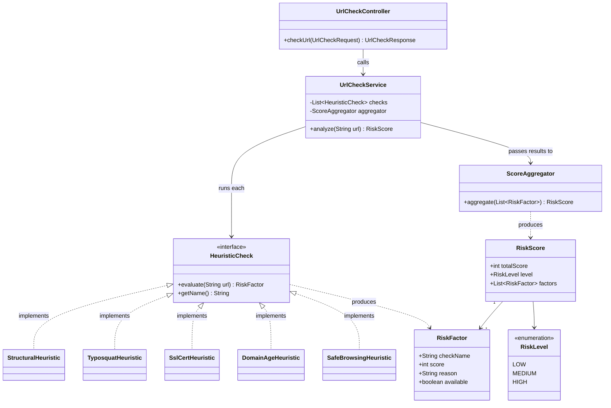

# Architecture

## System Overview

```
User
  |
  v
Browser (form submit / fetch call)
  |
  v
Spring Boot App (Render, single service)
  |
  +--> Structural check        (local, no external call)
  +--> Typosquat check         (local, against static brand list)
  +--> SSL certificate check   (direct TLS handshake to the submitted host)
  +--> Domain age check        (RDAP/WHOIS lookup)
  +--> Safe Browsing check     (Google Safe Browsing API)
  |
  v
Score aggregation
  |
  v
Response rendered back to user
```

No database in v1. Every request is stateless — computed fresh, nothing
persisted.

## Tech Stack
- Java 17, Spring Boot 3.x, Maven
- Frontend: single page (Thymeleaf or static HTML + fetch — decided in
  Phase 8 of IMPLEMENTATION_PLAN.md)
- Deployment: Render free tier
- External services: Google Safe Browsing API, RDAP (domain age), Java's
  built-in `javax.net.ssl` (certificate check)

## Project Structure
```
/src/main/java/.../phishingdetector
  /controller      # REST endpoint(s)
  /service         # Orchestration + aggregation
  /heuristics      # HeuristicCheck interface + 5 implementations
  /model           # RiskFactor, RiskScore, RiskLevel
  /config          # Rate limiting, external API client config
/src/main/resources
  /templates       # If using Thymeleaf
  /static          # CSS/JS if using static frontend
  application.properties
/docs              # This documentation set
```

## Class Design

The core is a **Strategy pattern**: one interface, five interchangeable
implementations, so adding a 6th heuristic later never touches existing
code — just a new class plus one line registering it.



### Why this shape
- `UrlCheckController` only handles HTTP — no business logic.
- `UrlCheckService` doesn't know *how* any individual check works, only that
  every `HeuristicCheck` can `evaluate(url)` and return a `RiskFactor`. This
  is the same interface-based thinking from your OOP coursework, applied for
  a real reason: a failing or slow check (e.g. Safe Browsing API down)
  is isolated to its own class and can't take down the others.
- `RiskFactor.available` lets a check say "I couldn't run" (timeout, API
  error) without being mistaken for "I ran and found nothing" — this is
  what makes graceful degradation (TRD.md §4) actually implementable.
- `ScoreAggregator` is separate from the service so the scoring *formula*
  (how much each factor weighs) can change without touching how checks run.

## Data Flow
1. User submits a URL.
2. Controller validates it's a parseable URL, passes it to the service.
3. Service runs all five `HeuristicCheck` implementations (can be
   sequential for v1; parallelized with `CompletableFuture` later if
   latency becomes an issue — see IMPLEMENTATION_PLAN.md Phase 9).
4. Each check returns a `RiskFactor` (or marks itself unavailable on
   failure/timeout).
5. `ScoreAggregator` combines the factors into a `RiskScore` with an overall
   `RiskLevel`.
6. Response rendered back with the full breakdown.

## Scalability Notes (not needed for v1, noted for awareness)
- Render free tier spins down after ~15 min idle — first request after
  idle will be slow (cold start). This is a known, acceptable trade-off for
  a free portfolio deployment.
- If rate limiting becomes a real need beyond basic per-IP throttling,
  an in-memory bucket (e.g. Bucket4j) is enough — no external service
  required at this scale.
- WHOIS/Safe Browsing results could be cached in-memory (same domain
  checked twice in a short window) to reduce external calls — explicitly
  out of scope for v1.
